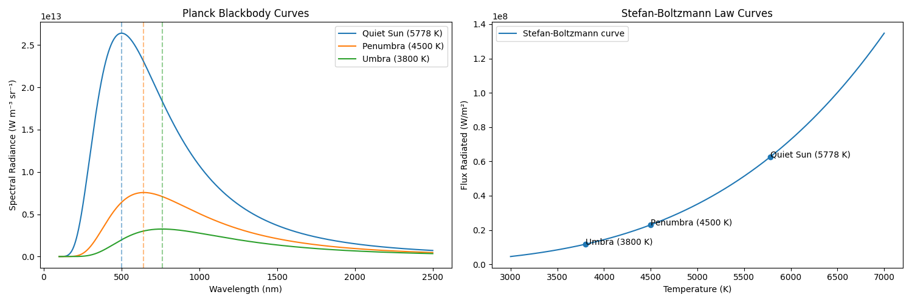
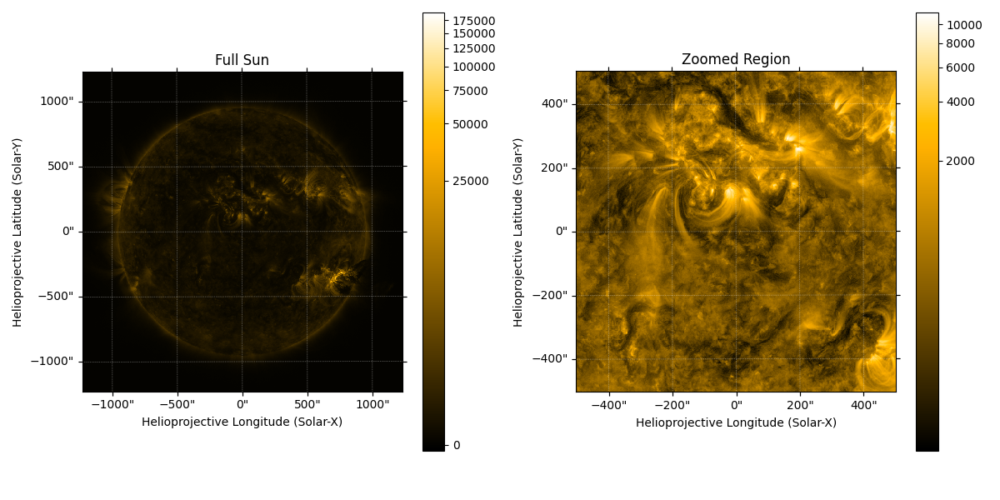

# Solar Physics

## Projects

### 1. Blackbody Radiation and Solar Intensity

**What it Does:**  
Models spectral radiance and total emitted flux for different regions of the Sun, explaining observed brightness variations.

**Core Idea:**  
Radiative output depends strongly on temperature, governed by Planck’s law and the Stefan–Boltzmann relation.

**Approach:**
- Compute spectral radiance using Planck’s law
- Calculate total flux using the Stefan–Boltzmann law  
- Compare results across:
  - Quiet Sun (~5778 K)  
  - Penumbra (~4500 K)  
  - Umbra (~3800 K)  

**How it Works:**  
The model evaluates wavelength-dependent radiance and integrates it to obtain total flux. Due to the T⁴ dependence, small temperature differences produce large changes in emitted energy.

**Key Result:**  
A temperature drop from ~5778 K to ~3800 K reduces emitted flux by approximately **81%**.

**Key Insight:**  
Sunspots appear dark not because they emit little energy, but because emission is highly sensitive to temperature.

**Stack:** Python, NumPy, Matplotlib

### 2. Solar EUV Imaging and Region Extraction

**What it Does:**  
Processes solar EUV imagery to extract and analyze localized regions from full-disk observations.

**Core Idea:**  
Coordinate-based submapping enables targeted analysis of solar structures.

**Approach:**
- Load AIA 171 Å solar image data  
- Define a region of interest using helioprojective coordinates  
- Extract and visualize the submap  

**How it Works:**  
Using SunPy and Astropy, the model maps image data to physical coordinates and isolates a selected region. This allows focused analysis of solar features such as active regions and coronal structures.

**Key Insight:**  
Combining physical coordinates with imaging data enables precise, localized study of large-scale solar observations.

**Stack:** Python, Matplotlib, Astropy, SunPy

